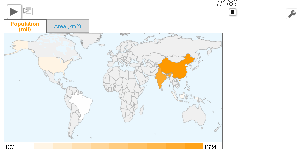
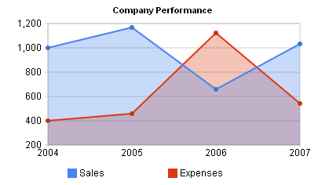

# Overview

This WebSharper Extension provides WebSharper bindings to the [Google
Visualization](https://developers.google.com/chart/) library that
provides rich, interactive charts and other data visualizations
that run in the browser. It supports many common chart type
sincluding image and interactive charts, maps, and data
tables. The complete list of examples can be found at the Google
Chart Tools
[Gallery](https://developers.google.com/chart/interactive/docs/gallery).

The visualizations run in all modern JavaScript-enabled
browsers. Some of the visualizations may require Adobe® Flash®
Player for rendering.

With the Google Visualization WebSharper Extensions you can develop
WebSharper applications that use the Google Visualization API using
nothing but F# code.

# Examples

## DataTable

All the visualizations use the same interface for representing data.
Data is represented by either the `DataTable` object or the `DataView`
object.

The following example creates a simple DataTable with 3 columns and 3
records:

```fsharp
[<JavaScript>]
let MyData =
    let data = new Base.DataTable()
    data.addColumn(StringType, "Name") |> ignore
    data.addColumn(NumberType, "Height") |> ignore
    data.addColumn(BooleanType, "Smokes") |> ignore
    data.setCell(0., 0., "Tong Ning mu") |> ignore
    data.setCell(1., 0., "Huang Ang fa") |> ignore
    data.setCell(2., 0., "Teng nu") |> ignore
    data.setCell(0., 1., 174.) |> ignore
    data.setCell(1., 1., 523.) |> ignore
    data.setCell(2., 1., 86.) |> ignore
    data.setCell(0., 2., true) |> ignore
    data.setCell(1., 2., false) |> ignore
    data.setCell(2., 2., true) |> ignore
    data
```

First, you add the columns (lines 4-6).  Every column is defined by a
type and an optional label.  The `addColumn` method returns a number
indicating the amount of columns in the `DataTable`, and has to be
piped to `ignore`.

Having the schema defined you proceed to add the rows.  For this, you
first call the `addRows` with the number of items you expect to add to
the `DataTable`.  Then you set every item using the `setCell` method.

Another way to build data is the `addRows` method.

```fsharp
[<JavaScript>]
let OtherData =
    let data = new Base.DataTable()
    data.addColumn(DateType, "Date") |> ignore
    data.addColumn(NumberType, "Sales") |> ignore
    data.addColumn(NumberType, "Expenses") |> ignore
    data.addRows [|
      (new Date(2004, 0, 1), 1000, 300)
      (new Date(2005, 0, 1), 1150, 450)
      (new Date(2006, 0, 1), 650, 1120)
      (new Date(2007, 0, 1), 1020, 550)
    |]
    |> ignore
```

Each tuple corresponds to a row in the `DataTable`.

In case you need to provide more information about individual values,
such as formatting information or custom properties, you can use
arrays of `Base.Cell` objects instead of tuples of values.

## Visualization

Once you have filled your `DataTable`, visualizing it is as simple as:

  * creating the type of visualization you want, passing the HTML
    element into which you want to render it.
  * calling the `draw` method on it with your data and any potential
    rendering options.

For example, to view the above `OtherData` using a line chart, use the
following:

```fsharp
[<JavaScript>]
let MyLineChart =
    let visualization = new LineChart(container.Body)
    visualization.draw(OtherData,
        LineChartOptions(
            width = 400,
            height = 240,
            legend = Legend(position = LegendPosition.Top),
            title = "Company Performance"))
```


And for a table, just change the type of the visualization object:

```fsharp
[<JavaScript>]
let MyTable =
    let visualization = new Table(container.Body)
    visualization.draw(OtherData,
        TableOptions(
            width = 400,
            height = 240,
            legend = Legend(position = LegendPosition.Top),
            title = "Company Performance"))
```

## DataView

`DataView` allows you to manipulate a `DataTable` to provide multiple
views of the data.  The following example demonstrates its use.

Let's take `MyData` from the first example. When visualized using
`Table`, this `DataTable` will look like this:


The following code creates 10 different `DataView` objects based on
`MyData`:

```fsharp
[<JavaScript>]
let Views =
    let views = 
        [| 
            for i in 1..10  ->
                new DataView(TableData)
        |]
```

You now can hide and show columns by column index:

```fsharp
views.[1].hideColumns [|1; 2|]
views.[2].hideRows [|0; 2|]
```

The result looks like this:


Another useful method allows you to select and order a subset of the
columns and rows.

```fsharp
views.[3].setColumns [|1; 1|]
views.[4].setRows [|0; 2|]
```

Result:


The set methods can be used together with the `getSortedRows`.  This
method returns an array of indices that correspond to a sort criteria.
There are 2 methods supported.  The first allows you to specify the
column you want to sort by.

```fsharp
let simpleOrder = views.[5].getSortedRows(1)
views.[5].setRows simpleOrder
```

The second allows you to add an array of sorting criteria, being the
first the most important.  This method receives a boolean to select if
the sorting should be done in ascending or descending order.

```fsharp
let complexOrder =
    let by i b = SortType.By(i, b)
    views.[6].getSortedRows([| by 2 false; by 0 true|])
views.[6].setRows complexOrder
```

Result:


The `setColumns` method is overloaded to add calculated columns.  A
simple example is the following:

```fsharp
let c1 = Column.Float((fun _ -> 5.), "Five")
views.[7].setColumns [| c1 |]
```

The function receives the current row of the column and the
`DataTable` object.  With these capabilities it is easy to create an
accumulated column of the values in column 1.

```fsharp
let accum = 
    Column.Float(
        (fun (t, r) ->
            seq {
                for i in 0..(int r) -> 
                    As<float> (t.getValue(i, 1))
            }
            |> Seq.sum),
        "Accum")
let idx = Column.Index
views.[8].setColumns [| idx 0; idx 1; idx 2; accum |]
views
```

The result is the following:


# Screenshots








